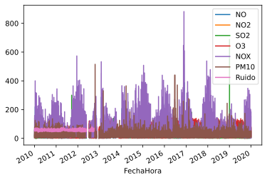

# Creación y primeras manipulaciones de `Series` y `DataFrame` con pandas
## Crear manualmente las `Series` y `DataFrame` siguientes:


```python
# Completar aquí

# --------------------

```

    a    0.0
    b    1.0
    c   -3.2
    d    5.0
    dtype: float64


Para el siguiente, usad un `dict` como argumento de `pd.Series`


```python
# Completar aquí

# --------------------

```

    a     rojo
    b    verde
    c     azul
    Name: color, dtype: object


```python
# Completar aquí

# --------------------

```

            x  y
    pepe    0  3
    luis   -2  2
    daniel  4  0


Para el siguiente, usad un diccionario de `Series`.


```python
# Completar aquí

# --------------------

```

              x    y
    daniel  NaN  0.0
    luis    3.0  2.0
    mateo  -1.0  NaN
    pepe    2.0  3.0


## Carga de datos

Empezad por importar el submódulo `path` de `os` y definir DATA_DIRECTORY


```python
# Completar aquí

# --------------------

```

1. Cargar dos de los ficheros de datos que tenéis en el archivo comprimido datos.zip. Está situado en la carpeta data del Aula virtual. Para cada uno de ellos, indicad cuántas filas y cuántas columnas tiene.

2. Cargad el fichero datos_cairo.csv
Una vez que lo habéis cargado en un DataFrame, obtened los 5 primeras filas y las 5 últimas filas del conjunto.


```python
# Completar aquí

# --------------------

```

             x        y
    0  55.3846  97.1795
    1  51.5385  96.0256
    2  46.1538  94.4872
    3  42.8205  91.4103
    4  40.7692  88.3333
               x        y
    137  39.4872  25.3846
    138  91.2821  41.5385
    139  50.0000  95.7692
    140  47.9487  95.0000
    141  44.1026  92.6923


Calculad la media, la desviación típica de cada columna.


```python
# Completar aquí

# --------------------

```

    Media:
     x    54.263273
    y    47.832253
    dtype: float64
    Desv. típica:
     x    16.765142
    y    26.935403
    dtype: float64


Realizad una representación gráfica, usando  el método `plot.scatter` Referencia [aquí](https://pandas.pydata.org/pandas-docs/stable/reference/api/pandas.DataFrame.plot.scatter.html)


3. Cargad el fichero mompean.csv.
 
> Se trata de de un conjunto de datos asociados a los niveles de calidad del aire en la calle de Mompean, muy cerca de la ETSIT.


```python
from IPython import display
display.Image('https://multimediarepository.blob.core.windows.net/imagecontainer/918d76ed992e4c8ca117aa7b4a7f7156.jpg')

```


    

    


Contiene las medias horarias de distintos indicadores de Calidad del aire: NO (µg/m³N)	NO2 (µg/m³N)	SO2 (µg/m³N)	O3 (µg/m³N)	TMP (ºC)	HR (Humedad Relativa % H.R.)	NOX (µg/m³N)	DD (Dirección del viento, grados)	PRB (Presión atmosférica, mb)	RS (Radiación Solar W/m³)	VV (Velocidad viento m/s)	C6H6 (µg/m³N)	C7H8 (µg/m³N)	XIL (µg/m³N)	PM10 (µg/m³N)	Ruido (dBA)


```python
# Completar aquí

# --------------------

```


<div>
<style scoped>
    .dataframe tbody tr th:only-of-type {
        vertical-align: middle;
    }

    .dataframe tbody tr th {
        vertical-align: top;
    }

    .dataframe thead th {
        text-align: right;
    }
</style>
<table border="1" class="dataframe">
  <thead>
    <tr style="text-align: right;">
      <th></th>
      <th>FechaHora</th>
      <th>NO</th>
      <th>NO2</th>
      <th>SO2</th>
      <th>O3</th>
      <th>TMP</th>
      <th>HR</th>
      <th>NOX</th>
      <th>DD</th>
      <th>PRB</th>
      <th>RS</th>
      <th>VV</th>
      <th>C6H6</th>
      <th>C7H8</th>
      <th>XIL</th>
      <th>PM10</th>
      <th>Ruido</th>
    </tr>
  </thead>
  <tbody>
    <tr>
      <th>0</th>
      <td>2010-01-01 00:00:00</td>
      <td>4.0</td>
      <td>7.0</td>
      <td>17.0</td>
      <td>NaN</td>
      <td>NaN</td>
      <td>NaN</td>
      <td>14.0</td>
      <td>NaN</td>
      <td>NaN</td>
      <td>NaN</td>
      <td>NaN</td>
      <td>NaN</td>
      <td>NaN</td>
      <td>NaN</td>
      <td>5.0</td>
      <td>56.0</td>
    </tr>
    <tr>
      <th>1</th>
      <td>2010-01-01 01:00:00</td>
      <td>6.0</td>
      <td>12.0</td>
      <td>18.0</td>
      <td>NaN</td>
      <td>NaN</td>
      <td>NaN</td>
      <td>21.0</td>
      <td>NaN</td>
      <td>NaN</td>
      <td>NaN</td>
      <td>NaN</td>
      <td>NaN</td>
      <td>NaN</td>
      <td>NaN</td>
      <td>15.0</td>
      <td>58.0</td>
    </tr>
    <tr>
      <th>2</th>
      <td>2010-01-01 02:00:00</td>
      <td>6.0</td>
      <td>17.0</td>
      <td>17.0</td>
      <td>NaN</td>
      <td>NaN</td>
      <td>NaN</td>
      <td>26.0</td>
      <td>NaN</td>
      <td>NaN</td>
      <td>NaN</td>
      <td>NaN</td>
      <td>NaN</td>
      <td>NaN</td>
      <td>NaN</td>
      <td>12.0</td>
      <td>60.0</td>
    </tr>
    <tr>
      <th>3</th>
      <td>2010-01-01 03:00:00</td>
      <td>5.0</td>
      <td>10.0</td>
      <td>18.0</td>
      <td>NaN</td>
      <td>NaN</td>
      <td>NaN</td>
      <td>18.0</td>
      <td>NaN</td>
      <td>NaN</td>
      <td>NaN</td>
      <td>NaN</td>
      <td>NaN</td>
      <td>NaN</td>
      <td>NaN</td>
      <td>2.0</td>
      <td>57.0</td>
    </tr>
    <tr>
      <th>4</th>
      <td>2010-01-01 04:00:00</td>
      <td>4.0</td>
      <td>8.0</td>
      <td>19.0</td>
      <td>NaN</td>
      <td>NaN</td>
      <td>NaN</td>
      <td>14.0</td>
      <td>NaN</td>
      <td>NaN</td>
      <td>NaN</td>
      <td>NaN</td>
      <td>NaN</td>
      <td>NaN</td>
      <td>NaN</td>
      <td>5.0</td>
      <td>55.0</td>
    </tr>
    <tr>
      <th>...</th>
      <td>...</td>
      <td>...</td>
      <td>...</td>
      <td>...</td>
      <td>...</td>
      <td>...</td>
      <td>...</td>
      <td>...</td>
      <td>...</td>
      <td>...</td>
      <td>...</td>
      <td>...</td>
      <td>...</td>
      <td>...</td>
      <td>...</td>
      <td>...</td>
      <td>...</td>
    </tr>
    <tr>
      <th>96403</th>
      <td>2019-12-31 19:00:00</td>
      <td>9.0</td>
      <td>35.0</td>
      <td>8.0</td>
      <td>47.0</td>
      <td>NaN</td>
      <td>NaN</td>
      <td>49.0</td>
      <td>NaN</td>
      <td>NaN</td>
      <td>NaN</td>
      <td>NaN</td>
      <td>NaN</td>
      <td>NaN</td>
      <td>NaN</td>
      <td>19.0</td>
      <td>NaN</td>
    </tr>
    <tr>
      <th>96404</th>
      <td>2019-12-31 20:00:00</td>
      <td>29.0</td>
      <td>59.0</td>
      <td>9.0</td>
      <td>24.0</td>
      <td>NaN</td>
      <td>NaN</td>
      <td>102.0</td>
      <td>NaN</td>
      <td>NaN</td>
      <td>NaN</td>
      <td>NaN</td>
      <td>NaN</td>
      <td>NaN</td>
      <td>NaN</td>
      <td>41.0</td>
      <td>NaN</td>
    </tr>
    <tr>
      <th>96405</th>
      <td>2019-12-31 21:00:00</td>
      <td>59.0</td>
      <td>65.0</td>
      <td>8.0</td>
      <td>10.0</td>
      <td>NaN</td>
      <td>NaN</td>
      <td>155.0</td>
      <td>NaN</td>
      <td>NaN</td>
      <td>NaN</td>
      <td>NaN</td>
      <td>NaN</td>
      <td>NaN</td>
      <td>NaN</td>
      <td>48.0</td>
      <td>NaN</td>
    </tr>
    <tr>
      <th>96406</th>
      <td>2019-12-31 22:00:00</td>
      <td>51.0</td>
      <td>51.0</td>
      <td>9.0</td>
      <td>11.0</td>
      <td>NaN</td>
      <td>NaN</td>
      <td>130.0</td>
      <td>NaN</td>
      <td>NaN</td>
      <td>NaN</td>
      <td>NaN</td>
      <td>NaN</td>
      <td>NaN</td>
      <td>NaN</td>
      <td>45.0</td>
      <td>NaN</td>
    </tr>
    <tr>
      <th>96407</th>
      <td>2019-12-31 23:00:00</td>
      <td>32.0</td>
      <td>42.0</td>
      <td>9.0</td>
      <td>7.0</td>
      <td>NaN</td>
      <td>NaN</td>
      <td>90.0</td>
      <td>NaN</td>
      <td>NaN</td>
      <td>NaN</td>
      <td>NaN</td>
      <td>NaN</td>
      <td>NaN</td>
      <td>NaN</td>
      <td>44.0</td>
      <td>NaN</td>
    </tr>
  </tbody>
</table>
<p>96408 rows × 17 columns</p>
</div>


- Cuántas filas y cuántas columnas tiene el conjunto?
- De qué tipo es cada columna? 
- Cuál es rango de tiempo para los que tenemos mediciones?
- Qué quiere decir "NaN"? A qué corresponde según vosotros?
- Usando el método `info`, obtened, para cada columna, los números de datos faltantes. 


Para simplificar el conjunto, vamos a quitar todas las columnas que sólo tengan datos faltantes. Para ello, podéis usar el método `dropna` de pandas, comprobando su [referencia](https://pandas.pydata.org/pandas-docs/stable/reference/api/pandas.DataFrame.dropna.html)


```python
# Completar aquí 

# --------------------

```

                     FechaHora    NO   NO2   SO2    O3    NOX  PM10  Ruido
    0      2010-01-01 00:00:00   4.0   7.0  17.0   NaN   14.0   5.0   56.0
    1      2010-01-01 01:00:00   6.0  12.0  18.0   NaN   21.0  15.0   58.0
    2      2010-01-01 02:00:00   6.0  17.0  17.0   NaN   26.0  12.0   60.0
    3      2010-01-01 03:00:00   5.0  10.0  18.0   NaN   18.0   2.0   57.0
    4      2010-01-01 04:00:00   4.0   8.0  19.0   NaN   14.0   5.0   55.0
    ...                    ...   ...   ...   ...   ...    ...   ...    ...
    96403  2019-12-31 19:00:00   9.0  35.0   8.0  47.0   49.0  19.0    NaN
    96404  2019-12-31 20:00:00  29.0  59.0   9.0  24.0  102.0  41.0    NaN
    96405  2019-12-31 21:00:00  59.0  65.0   8.0  10.0  155.0  48.0    NaN
    96406  2019-12-31 22:00:00  51.0  51.0   9.0  11.0  130.0  45.0    NaN
    96407  2019-12-31 23:00:00  32.0  42.0   9.0   7.0   90.0  44.0    NaN
    
    [96408 rows x 8 columns]


Vamos a indicar a pandas, en el momento de cargar el fichero, que parsee la columna FechaHora como un objeto de tipo DateTime. Pare ello, consultad la [referencia](https://pandas.pydata.org/pandas-docs/stable/reference/api/pandas.read_csv.html) de `read_csv` y encontrad qué parámetro se puede usar.


```python
# Completar aquí

# --------------------

```

Volved a descartas las columnas que sólo tienen datos faltantes y comprobad el resultado con el método `info`


```python
# Completar aquí

# --------------------

```

    <class 'pandas.core.frame.DataFrame'>
    RangeIndex: 96408 entries, 0 to 96407
    Data columns (total 8 columns):
     #   Column     Non-Null Count  Dtype         
    ---  ------     --------------  -----         
     0   FechaHora  96408 non-null  datetime64[ns]
     1   NO         88352 non-null  float64       
     2   NO2        88352 non-null  float64       
     3   SO2        89823 non-null  float64       
     4   O3         85685 non-null  float64       
     5   NOX        88352 non-null  float64       
     6   PM10       89532 non-null  float64       
     7   Ruido      31303 non-null  float64       
    dtypes: datetime64[ns](1), float64(7)
    memory usage: 5.9 MB


Qué tipo de `index` tiene ahora mismo nuestro conjunto? Si quisieramos usar una de las columnas del conjunto como etiqueta de cada fila, y por lo tanto definirla como nuestro `index`, cuál sería una elección natural?
Realizad esta definición de `index` usando el método `set_index` de pandas. Referencia [aquí](https://pandas.pydata.org/pandas-docs/stable/reference/api/pandas.DataFrame.set_index.html) 


```python
# Completar aquí

# --------------------

```

Para obtener unas primeras representaciones gráficas, usad el método plot aplicado a nuestro dataframe


```python
# Completar aquí

# --------------------

```


    

    

