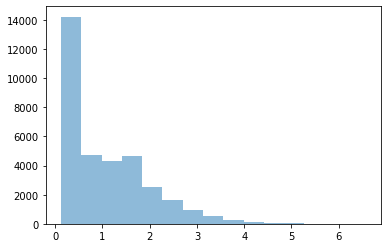
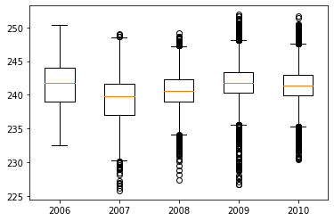
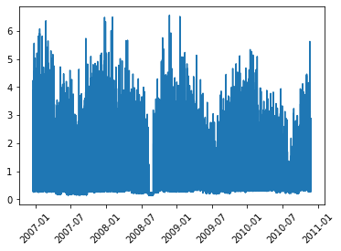
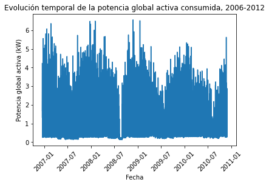
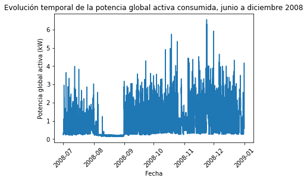
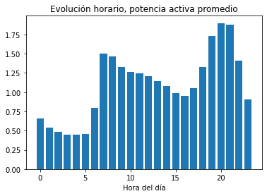
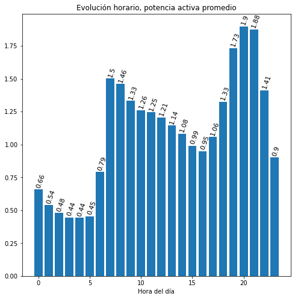
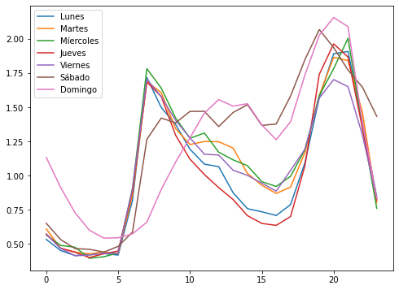

# Trabajo. Visualización de datos: consumo eléctrico de una vivienda.

En este trabajo, tenéis que completar algunos de los bloques de código para contestar a las preguntas que van apareciendo en el documento. 


Usaremos en este trabajo  los datos que ya exploramos en el trabajo sobre manipulación de datos y cálculo de resúmenes por grupos. El fichero es `household_hourly_power_consumption.txt`, que se puede descargar del aula virtual.

Empezamos por importar los módulos `pandas`, `pyplot` de `matplotlib`, y `path` de `os`, para tratar las  localizaciones de ficheros.


```python
# Completar aquí: importar módulos

# --------------------

```

## Cargamos los datos
Definimos la variable `DATA_DIRECTORY` que indica dónde están situados nuestros datos respecto a la localización de este `notebook`.


```python
# Completar aquí: definir DATA_DIRECTORY

# --------------------

```

Podemos importar los datos en un `DataFrame` que llamaremos `vivienda`. Lo haremos especificando que la columna `date_hour` debe ser parseada como `datetime` y que la usaremos como `index`. Indicaremos la ubicación del fichero de datos usando `path.join` y la variable `DATA_DIRECTORY`.


```python
# Completar aquí

# --------------------
vivienda
```


<div>
<style scoped>
    .dataframe tbody tr th:only-of-type {
        vertical-align: middle;
    }

    .dataframe tbody tr th {
        vertical-align: top;
    }

    .dataframe thead th {
        text-align: right;
    }
</style>
<table border="1" class="dataframe">
  <thead>
    <tr style="text-align: right;">
      <th></th>
      <th>global_active_power</th>
      <th>global_reactive_power</th>
      <th>voltage</th>
      <th>global_intensity</th>
      <th>sub_metering_1</th>
      <th>sub_metering_2</th>
      <th>sub_metering_3</th>
    </tr>
    <tr>
      <th>date_hour</th>
      <th></th>
      <th></th>
      <th></th>
      <th></th>
      <th></th>
      <th></th>
      <th></th>
    </tr>
  </thead>
  <tbody>
    <tr>
      <th>2006-12-16 17:00:00</th>
      <td>4.222889</td>
      <td>0.229000</td>
      <td>234.643889</td>
      <td>18.100000</td>
      <td>0.0</td>
      <td>0.527778</td>
      <td>16.861111</td>
    </tr>
    <tr>
      <th>2006-12-16 18:00:00</th>
      <td>3.632200</td>
      <td>0.080033</td>
      <td>234.580167</td>
      <td>15.600000</td>
      <td>0.0</td>
      <td>6.716667</td>
      <td>16.866667</td>
    </tr>
    <tr>
      <th>2006-12-16 19:00:00</th>
      <td>3.400233</td>
      <td>0.085233</td>
      <td>233.232500</td>
      <td>14.503333</td>
      <td>0.0</td>
      <td>1.433333</td>
      <td>16.683333</td>
    </tr>
    <tr>
      <th>2006-12-16 20:00:00</th>
      <td>3.268567</td>
      <td>0.075100</td>
      <td>234.071500</td>
      <td>13.916667</td>
      <td>0.0</td>
      <td>0.000000</td>
      <td>16.783333</td>
    </tr>
    <tr>
      <th>2006-12-16 21:00:00</th>
      <td>3.056467</td>
      <td>0.076667</td>
      <td>237.158667</td>
      <td>13.046667</td>
      <td>0.0</td>
      <td>0.416667</td>
      <td>17.216667</td>
    </tr>
    <tr>
      <th>...</th>
      <td>...</td>
      <td>...</td>
      <td>...</td>
      <td>...</td>
      <td>...</td>
      <td>...</td>
      <td>...</td>
    </tr>
    <tr>
      <th>2010-11-26 17:00:00</th>
      <td>1.725900</td>
      <td>0.061400</td>
      <td>237.069667</td>
      <td>7.216667</td>
      <td>0.0</td>
      <td>0.000000</td>
      <td>12.866667</td>
    </tr>
    <tr>
      <th>2010-11-26 18:00:00</th>
      <td>1.573467</td>
      <td>0.053700</td>
      <td>237.531833</td>
      <td>6.620000</td>
      <td>0.0</td>
      <td>0.000000</td>
      <td>0.000000</td>
    </tr>
    <tr>
      <th>2010-11-26 19:00:00</th>
      <td>1.659333</td>
      <td>0.060033</td>
      <td>236.741000</td>
      <td>7.056667</td>
      <td>0.0</td>
      <td>0.066667</td>
      <td>0.000000</td>
    </tr>
    <tr>
      <th>2010-11-26 20:00:00</th>
      <td>1.163700</td>
      <td>0.061167</td>
      <td>239.396000</td>
      <td>4.913333</td>
      <td>0.0</td>
      <td>1.066667</td>
      <td>0.000000</td>
    </tr>
    <tr>
      <th>2010-11-26 21:00:00</th>
      <td>0.934667</td>
      <td>0.000000</td>
      <td>239.690000</td>
      <td>3.800000</td>
      <td>0.0</td>
      <td>0.000000</td>
      <td>0.000000</td>
    </tr>
  </tbody>
</table>
<p>34589 rows × 7 columns</p>
</div>


## Histograma de la potencia global activa
Empezaremos por representar un histograma de la potencia global activa, con 15 clases ("bins"). Este número de 15 se ha calculado usando la regla de Sturges.


```python
# Completar aquí

# --------------------

```


    

    


## Boxplots del voltaje según los años.
Vamos a obtener ahora unos diagramas de cajabigotes del voltaje según cada año. Para ello, empezamos por obtener cuántos datos tenemos por año en el conjunto. 


```python
# Completar aquí:

# --------------------

```


    date_hour
    2006     367
    2007    8760
    2008    8784
    2009    8760
    2010    7918
    dtype: int64


Nuestra intención es hacer una gráfica que contenga los diagramas de caja bigotes uno al lado del otro, donde el eje Ox es el eje de los años, de 2006 a 2010.

Para ello, tendremos que usar una lista que contenga las series de `voltage` año por año y pasarla a `ax.boxplot`.


```python
# Completar aquí

# --------------------

```


    

    


Es posible (probable?) que, en vuestra gráfica, sólo aparezcan los años 2006 y 2008, a qué se podría deber? Cómo podríamos arreglarlo?

## Gráficas para la potencia global activa

Empezamos por representar la evolución temporal de la potencia global activa.


```python
# Completar aquí

# --------------------

```


    

    


Se observa algo destacable?

### Pequeñas modificaciones de la gráfica:

Realizad las modificaciones siguientes sobre la gráfica temporal:

1. Cambiad las etiquetas de los ejes: en el eje Ox, ponemos "Fecha", mientras que en el eje poned "Potencia global activa (kW).
2. Añadid el título "Evolución temporal de la potencia global activa consumida, 2006-2012"
3. Usando la función `savefig` de pyplot, guardad la gráfica en un fichero llamado potencia-global-activa-2006-2012.png en carpeta "figures" de vuestro directorio de trabajo para este trabajo. 


```python
# Completar aquí

# --------------------

```


    

    


### Seleccionamos los meses de julio a diciembre de 2008

Queremos realizar la misma gráfica pero si nos limitamos a los meses de julio hasta diciembre de 2008.
- Empezaremos por crear un `DataFrame` llamado `vivienda_2008` que sólo contenga las etiquetas de tiempo desde el 1 de julio de 2008 hasta el 31 de diciembre de 2008.
- Podemos usar `loc` para seleccionar etiquetas. Como el `index` es de tipo `datetime`, usaremos el constructor `datetime` del módulo `datetime`. Esta función nos permite construir una fecha especificando el año, mes y día, hora, mínuto, segundo. Ver su [documentación](https://docs.python.org/3/library/datetime.html#datetime.datetime)


```python
# Completar aquí

# --------------------
print(f'Menor registro de tiempo: {vivienda_2008.index.min()}')
print(f'Mayor registro de tiempo: {vivienda_2008.index.max()}')
print(f'Número de registros: {vivienda_2008.shape[0]}')
```

    Menor registro de tiempo: 2008-07-01 00:00:00
    Mayor registro de tiempo: 2008-12-31 23:00:00
    Número de registros: 4416


Hacemos la representación gráfica de la columna `global_active_power` de `vivienda_2008`.


```python
# Completar aquí

# --------------------

```


    

    


### Exploración del perfil horario de la potencia global consumida.


Vamos a explorar el perfil de evolución horario de la potencia global consumida.

Para ello, empezamos por construir un `DataFrame` que llamaremos *resumen_horario* y que
contenga el valor promedio de la potencia global activa consumida por hora (el promedio se hará, por hora, sobre todo
el conjunto `vivienda`).

`resumen_horario` tendrá por `index` la hora, y tendrá dos columnas `promedio`,  y n (el número de datos utilizado para calcular la media en cada grupo)

> Para obtener la hora de la columna `index` de `vivienda`, podréis usar el atributo `hour` de un objeto `Datetime`.


```python
# Completar aquí

# --------------------
resumen_horario

```


<div>
<style scoped>
    .dataframe tbody tr th:only-of-type {
        vertical-align: middle;
    }

    .dataframe tbody tr th {
        vertical-align: top;
    }

    .dataframe thead th {
        text-align: right;
    }
</style>
<table border="1" class="dataframe">
  <thead>
    <tr style="text-align: right;">
      <th></th>
      <th>promedio</th>
      <th>n</th>
    </tr>
    <tr>
      <th>date_hour</th>
      <th></th>
      <th></th>
    </tr>
  </thead>
  <tbody>
    <tr>
      <th>0</th>
      <td>0.659562</td>
      <td>1426</td>
    </tr>
    <tr>
      <th>1</th>
      <td>0.539325</td>
      <td>1424</td>
    </tr>
    <tr>
      <th>2</th>
      <td>0.480618</td>
      <td>1424</td>
    </tr>
    <tr>
      <th>3</th>
      <td>0.444850</td>
      <td>1424</td>
    </tr>
    <tr>
      <th>4</th>
      <td>0.443844</td>
      <td>1422</td>
    </tr>
    <tr>
      <th>5</th>
      <td>0.453674</td>
      <td>1421</td>
    </tr>
    <tr>
      <th>6</th>
      <td>0.791606</td>
      <td>1421</td>
    </tr>
    <tr>
      <th>7</th>
      <td>1.502373</td>
      <td>1422</td>
    </tr>
    <tr>
      <th>8</th>
      <td>1.460940</td>
      <td>1422</td>
    </tr>
    <tr>
      <th>9</th>
      <td>1.331642</td>
      <td>1422</td>
    </tr>
    <tr>
      <th>10</th>
      <td>1.260913</td>
      <td>1422</td>
    </tr>
    <tr>
      <th>11</th>
      <td>1.246408</td>
      <td>1422</td>
    </tr>
    <tr>
      <th>12</th>
      <td>1.207061</td>
      <td>1422</td>
    </tr>
    <tr>
      <th>13</th>
      <td>1.144471</td>
      <td>1423</td>
    </tr>
    <tr>
      <th>14</th>
      <td>1.082750</td>
      <td>1424</td>
    </tr>
    <tr>
      <th>15</th>
      <td>0.990806</td>
      <td>1423</td>
    </tr>
    <tr>
      <th>16</th>
      <td>0.948805</td>
      <td>1423</td>
    </tr>
    <tr>
      <th>17</th>
      <td>1.056164</td>
      <td>1423</td>
    </tr>
    <tr>
      <th>18</th>
      <td>1.326433</td>
      <td>1424</td>
    </tr>
    <tr>
      <th>19</th>
      <td>1.733428</td>
      <td>1427</td>
    </tr>
    <tr>
      <th>20</th>
      <td>1.899073</td>
      <td>1427</td>
    </tr>
    <tr>
      <th>21</th>
      <td>1.876063</td>
      <td>1428</td>
    </tr>
    <tr>
      <th>22</th>
      <td>1.412681</td>
      <td>1426</td>
    </tr>
    <tr>
      <th>23</th>
      <td>0.902142</td>
      <td>1426</td>
    </tr>
  </tbody>
</table>
</div>


Podemos ahora representar gráficamente el perfil de evolución horario usando `resumen_horario`
(Global_active_power promedio en función de hora). Queremos hacerlo con barras verticales. 


```python
# Completar aquí

# --------------------

```


    

    


### Opcional:
Podemos añadir el valor de la potencia calculada encima de cada barra en la gráfica


```python
# Completar aquí

# --------------------

```


    

    


Vamos a ver si el perfil de evolución horaria es diferente según los días de la semana. Para ello,
necesitamos crear un nuevo `Series` resumen, que se llamará `resumen_horario_dia`, y que contenga
el promedio  de la potencia global activa consumida si desglosamos los datos por hora *y por día de la semana*.

Para que sea más fácil hacer referencia al día de la semana y a la hora, añadimos dos columnas a vivienda que contengan el día de la semana y la hora a la que se refiere la medición. Para ello, podremos usar los atributos `weekday` y `hour` del índice que es un objeto `Datetime`.


```python
# Completar aquí

# --------------------
vivienda.info()
```

    <class 'pandas.core.frame.DataFrame'>
    DatetimeIndex: 34589 entries, 2006-12-16 17:00:00 to 2010-11-26 21:00:00
    Data columns (total 9 columns):
     #   Column                 Non-Null Count  Dtype  
    ---  ------                 --------------  -----  
     0   global_active_power    34168 non-null  float64
     1   global_reactive_power  34168 non-null  float64
     2   voltage                34168 non-null  float64
     3   global_intensity       34168 non-null  float64
     4   sub_metering_1         34168 non-null  float64
     5   sub_metering_2         34168 non-null  float64
     6   sub_metering_3         34168 non-null  float64
     7   dia_semana             34589 non-null  int64  
     8   hora                   34589 non-null  int64  
    dtypes: float64(7), int64(2)
    memory usage: 3.6 MB


Calculamos ahora `resumen_horario_dia`.


```python
# Completar aquí

# --------------------
resumen_horario_dia
```


    dia_semana  hora
    0           0       0.531491
                1       0.450318
                2       0.413212
                3       0.423549
                4       0.428248
                          ...   
    6           19      2.026754
                20      2.157163
                21      2.089381
                22      1.387676
                23      0.834612
    Name: global_active_power, Length: 168, dtype: float64


Aplicamos el método `reset_index` (referencia: [enlace](https://pandas.pydata.org/pandas-docs/stable/reference/api/pandas.DataFrame.reset_index.html)) a `resumen_horario_dia`, para que el índice multinivel resultado de groupby dé lugar a dos columnas que correspondan a día de la semana y a hora del día. 


```python
# Completar aquí

# --------------------
resumen_horario_dia
```


<div>
<style scoped>
    .dataframe tbody tr th:only-of-type {
        vertical-align: middle;
    }

    .dataframe tbody tr th {
        vertical-align: top;
    }

    .dataframe thead th {
        text-align: right;
    }
</style>
<table border="1" class="dataframe">
  <thead>
    <tr style="text-align: right;">
      <th></th>
      <th>dia_semana</th>
      <th>hora</th>
      <th>global_active_power</th>
    </tr>
  </thead>
  <tbody>
    <tr>
      <th>0</th>
      <td>0</td>
      <td>0</td>
      <td>0.531491</td>
    </tr>
    <tr>
      <th>1</th>
      <td>0</td>
      <td>1</td>
      <td>0.450318</td>
    </tr>
    <tr>
      <th>2</th>
      <td>0</td>
      <td>2</td>
      <td>0.413212</td>
    </tr>
    <tr>
      <th>3</th>
      <td>0</td>
      <td>3</td>
      <td>0.423549</td>
    </tr>
    <tr>
      <th>4</th>
      <td>0</td>
      <td>4</td>
      <td>0.428248</td>
    </tr>
    <tr>
      <th>...</th>
      <td>...</td>
      <td>...</td>
      <td>...</td>
    </tr>
    <tr>
      <th>163</th>
      <td>6</td>
      <td>19</td>
      <td>2.026754</td>
    </tr>
    <tr>
      <th>164</th>
      <td>6</td>
      <td>20</td>
      <td>2.157163</td>
    </tr>
    <tr>
      <th>165</th>
      <td>6</td>
      <td>21</td>
      <td>2.089381</td>
    </tr>
    <tr>
      <th>166</th>
      <td>6</td>
      <td>22</td>
      <td>1.387676</td>
    </tr>
    <tr>
      <th>167</th>
      <td>6</td>
      <td>23</td>
      <td>0.834612</td>
    </tr>
  </tbody>
</table>
<p>168 rows × 3 columns</p>
</div>


Procedemos a la representación gráfica


```python
# Completar aquí

# --------------------


```


    

    


Qué conclusión sacáis sobre el patrón de consumo de la familia según los días de la semana?
