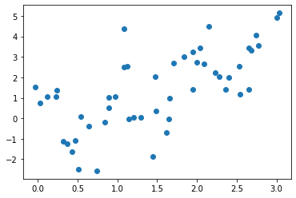
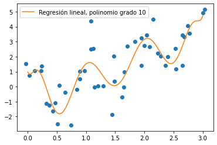
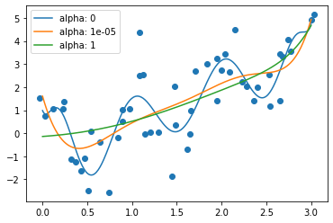
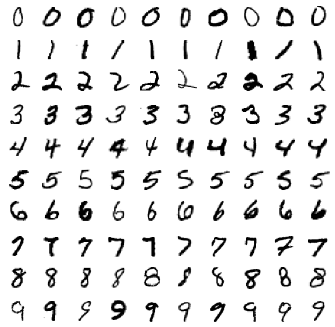

# Regularización para regresión y clasificación

## Regresión regularizada
Para ilustrar la regularización usando Ridge y Lasso, vamos a ajustar estos algoritmos a los datos del fichero `datos_regularizacion.csv` disponible en el aula virtual.

Cargad los datos en un dataframe llamado `datos`.


```python
# Completar aquí

# --------------------
datos
```


<div>
<style scoped>
    .dataframe tbody tr th:only-of-type {
        vertical-align: middle;
    }

    .dataframe tbody tr th {
        vertical-align: top;
    }

    .dataframe thead th {
        text-align: right;
    }
</style>
<table border="1" class="dataframe">
  <thead>
    <tr style="text-align: right;">
      <th></th>
      <th>x</th>
      <th>y</th>
    </tr>
  </thead>
  <tbody>
    <tr>
      <th>0</th>
      <td>-0.031161</td>
      <td>1.532027</td>
    </tr>
    <tr>
      <th>1</th>
      <td>0.032386</td>
      <td>0.758267</td>
    </tr>
    <tr>
      <th>2</th>
      <td>0.122271</td>
      <td>1.048393</td>
    </tr>
    <tr>
      <th>3</th>
      <td>0.230400</td>
      <td>1.066580</td>
    </tr>
    <tr>
      <th>4</th>
      <td>0.242299</td>
      <td>1.373395</td>
    </tr>
    <tr>
      <th>5</th>
      <td>0.318407</td>
      <td>-1.144595</td>
    </tr>
    <tr>
      <th>6</th>
      <td>0.367820</td>
      <td>-1.241243</td>
    </tr>
    <tr>
      <th>7</th>
      <td>0.428989</td>
      <td>-1.652124</td>
    </tr>
    <tr>
      <th>8</th>
      <td>0.474160</td>
      <td>-1.085733</td>
    </tr>
    <tr>
      <th>9</th>
      <td>0.538686</td>
      <td>0.077627</td>
    </tr>
    <tr>
      <th>10</th>
      <td>0.510293</td>
      <td>-2.510583</td>
    </tr>
    <tr>
      <th>11</th>
      <td>0.635958</td>
      <td>-0.372631</td>
    </tr>
    <tr>
      <th>12</th>
      <td>0.746401</td>
      <td>-2.566360</td>
    </tr>
    <tr>
      <th>13</th>
      <td>0.843866</td>
      <td>-0.207093</td>
    </tr>
    <tr>
      <th>14</th>
      <td>0.888163</td>
      <td>1.006309</td>
    </tr>
    <tr>
      <th>15</th>
      <td>0.890759</td>
      <td>0.494495</td>
    </tr>
    <tr>
      <th>16</th>
      <td>0.974362</td>
      <td>1.046445</td>
    </tr>
    <tr>
      <th>17</th>
      <td>1.080465</td>
      <td>4.386206</td>
    </tr>
    <tr>
      <th>18</th>
      <td>1.081205</td>
      <td>2.521744</td>
    </tr>
    <tr>
      <th>19</th>
      <td>1.121812</td>
      <td>2.554055</td>
    </tr>
    <tr>
      <th>20</th>
      <td>1.147877</td>
      <td>-0.019548</td>
    </tr>
    <tr>
      <th>21</th>
      <td>1.207192</td>
      <td>0.029249</td>
    </tr>
    <tr>
      <th>22</th>
      <td>1.297522</td>
      <td>0.056078</td>
    </tr>
    <tr>
      <th>23</th>
      <td>1.445494</td>
      <td>-1.856850</td>
    </tr>
    <tr>
      <th>24</th>
      <td>1.481000</td>
      <td>0.344983</td>
    </tr>
    <tr>
      <th>25</th>
      <td>1.479339</td>
      <td>2.049512</td>
    </tr>
    <tr>
      <th>26</th>
      <td>1.645022</td>
      <td>-0.025606</td>
    </tr>
    <tr>
      <th>27</th>
      <td>1.660121</td>
      <td>0.987305</td>
    </tr>
    <tr>
      <th>28</th>
      <td>1.612677</td>
      <td>-0.685272</td>
    </tr>
    <tr>
      <th>29</th>
      <td>1.707878</td>
      <td>2.702331</td>
    </tr>
    <tr>
      <th>30</th>
      <td>1.838174</td>
      <td>2.999529</td>
    </tr>
    <tr>
      <th>31</th>
      <td>1.949958</td>
      <td>1.410299</td>
    </tr>
    <tr>
      <th>32</th>
      <td>1.949867</td>
      <td>3.252207</td>
    </tr>
    <tr>
      <th>33</th>
      <td>2.002503</td>
      <td>2.745077</td>
    </tr>
    <tr>
      <th>34</th>
      <td>2.038505</td>
      <td>3.435487</td>
    </tr>
    <tr>
      <th>35</th>
      <td>2.090329</td>
      <td>2.658607</td>
    </tr>
    <tr>
      <th>36</th>
      <td>2.144371</td>
      <td>4.485044</td>
    </tr>
    <tr>
      <th>37</th>
      <td>2.224949</td>
      <td>2.236121</td>
    </tr>
    <tr>
      <th>38</th>
      <td>2.277139</td>
      <td>2.027844</td>
    </tr>
    <tr>
      <th>39</th>
      <td>2.358323</td>
      <td>1.426095</td>
    </tr>
    <tr>
      <th>40</th>
      <td>2.404323</td>
      <td>2.005983</td>
    </tr>
    <tr>
      <th>41</th>
      <td>2.536496</td>
      <td>1.188588</td>
    </tr>
    <tr>
      <th>42</th>
      <td>2.535906</td>
      <td>2.524782</td>
    </tr>
    <tr>
      <th>43</th>
      <td>2.649080</td>
      <td>1.421500</td>
    </tr>
    <tr>
      <th>44</th>
      <td>2.649342</td>
      <td>3.435120</td>
    </tr>
    <tr>
      <th>45</th>
      <td>2.686596</td>
      <td>3.325371</td>
    </tr>
    <tr>
      <th>46</th>
      <td>2.741800</td>
      <td>4.071819</td>
    </tr>
    <tr>
      <th>47</th>
      <td>2.776951</td>
      <td>3.537541</td>
    </tr>
    <tr>
      <th>48</th>
      <td>3.003023</td>
      <td>4.935828</td>
    </tr>
    <tr>
      <th>49</th>
      <td>3.029349</td>
      <td>5.145753</td>
    </tr>
  </tbody>
</table>
</div>


Llevad a cabo la representación gráfica del conjunto


```python
# Completar aquí

# --------------------

```


    

    


Ajustad una regresión lineal usando términos polinomiales de hasta grado 10. Después de incluir las características correspondientes a los términos de grado 10, llevad a cabo la estanderización de las características. 
Representad la curva ajustada en la gráfica anterior.


```python
# Completar aquí

# --------------------

```


    

    


## Ajuste de una Ridge regression con `alpha=1`
Usando la clase `Ridge` del submódulo `linear_model`, aplicad a los datos una regresión ridge con `alpha=1` usando, al igual que en el apartado anterior, términos polinomiales de grado 10.


```python
# Completar aquí

# --------------------

```


    

    


## Variamos `alpha` 
Representad los ajustes correspondientes a `alpha=0`, `alpha=0.00001`, `alpha=1` en la misma gráfica.
> Consejo: podéis usar un bucle sobre los valores de `alpha`, usando el método `set_params` que se puede aplicar a un estimador para cambiar algunos de sus parámetros (en este caso `alpha`)


```python
# Completar aquí

# --------------------

```


    

    


# Clasificación regularizada: ejemplo con el conjunto MNIST
MNIST es un conjunto de datos muy clásico en machine learning que consiste en imágenes de dígitos escritos a mano en sobres. Las imágenes tienen una resolución de 28 por 28 píxeles, por lo que cada imagen tiene 784 características, cada característica corresponde a la intensidad de gris del pixel correspondiente, va desde 0 (blanco) a 255 (negro).

MNIST está disponible para descargar desde `sklearn`, pero vamos a cargar una versión reducida con 10000 imágenes, el fichero se llama `mnist_784.10000.csv` y está disponible en el aula virtual. Usad el parámetro `dtype` en `read_csv` para especificar que la columna `y` es de tipo `str`.


```python
# Completar aquí: cargar los datos en un conjunto mnist

# --------------------
mnist
```


<div>
<style scoped>
    .dataframe tbody tr th:only-of-type {
        vertical-align: middle;
    }

    .dataframe tbody tr th {
        vertical-align: top;
    }

    .dataframe thead th {
        text-align: right;
    }
</style>
<table border="1" class="dataframe">
  <thead>
    <tr style="text-align: right;">
      <th></th>
      <th>pixel1</th>
      <th>pixel2</th>
      <th>pixel3</th>
      <th>pixel4</th>
      <th>pixel5</th>
      <th>pixel6</th>
      <th>pixel7</th>
      <th>pixel8</th>
      <th>pixel9</th>
      <th>pixel10</th>
      <th>...</th>
      <th>pixel776</th>
      <th>pixel777</th>
      <th>pixel778</th>
      <th>pixel779</th>
      <th>pixel780</th>
      <th>pixel781</th>
      <th>pixel782</th>
      <th>pixel783</th>
      <th>pixel784</th>
      <th>y</th>
    </tr>
  </thead>
  <tbody>
    <tr>
      <th>0</th>
      <td>0.0</td>
      <td>0.0</td>
      <td>0.0</td>
      <td>0.0</td>
      <td>0.0</td>
      <td>0.0</td>
      <td>0.0</td>
      <td>0.0</td>
      <td>0.0</td>
      <td>0.0</td>
      <td>...</td>
      <td>0.0</td>
      <td>0.0</td>
      <td>0.0</td>
      <td>0.0</td>
      <td>0.0</td>
      <td>0.0</td>
      <td>0.0</td>
      <td>0.0</td>
      <td>0.0</td>
      <td>0</td>
    </tr>
    <tr>
      <th>1</th>
      <td>0.0</td>
      <td>0.0</td>
      <td>0.0</td>
      <td>0.0</td>
      <td>0.0</td>
      <td>0.0</td>
      <td>0.0</td>
      <td>0.0</td>
      <td>0.0</td>
      <td>0.0</td>
      <td>...</td>
      <td>0.0</td>
      <td>0.0</td>
      <td>0.0</td>
      <td>0.0</td>
      <td>0.0</td>
      <td>0.0</td>
      <td>0.0</td>
      <td>0.0</td>
      <td>0.0</td>
      <td>0</td>
    </tr>
    <tr>
      <th>2</th>
      <td>0.0</td>
      <td>0.0</td>
      <td>0.0</td>
      <td>0.0</td>
      <td>0.0</td>
      <td>0.0</td>
      <td>0.0</td>
      <td>0.0</td>
      <td>0.0</td>
      <td>0.0</td>
      <td>...</td>
      <td>0.0</td>
      <td>0.0</td>
      <td>0.0</td>
      <td>0.0</td>
      <td>0.0</td>
      <td>0.0</td>
      <td>0.0</td>
      <td>0.0</td>
      <td>0.0</td>
      <td>0</td>
    </tr>
    <tr>
      <th>3</th>
      <td>0.0</td>
      <td>0.0</td>
      <td>0.0</td>
      <td>0.0</td>
      <td>0.0</td>
      <td>0.0</td>
      <td>0.0</td>
      <td>0.0</td>
      <td>0.0</td>
      <td>0.0</td>
      <td>...</td>
      <td>0.0</td>
      <td>0.0</td>
      <td>0.0</td>
      <td>0.0</td>
      <td>0.0</td>
      <td>0.0</td>
      <td>0.0</td>
      <td>0.0</td>
      <td>0.0</td>
      <td>0</td>
    </tr>
    <tr>
      <th>4</th>
      <td>0.0</td>
      <td>0.0</td>
      <td>0.0</td>
      <td>0.0</td>
      <td>0.0</td>
      <td>0.0</td>
      <td>0.0</td>
      <td>0.0</td>
      <td>0.0</td>
      <td>0.0</td>
      <td>...</td>
      <td>0.0</td>
      <td>0.0</td>
      <td>0.0</td>
      <td>0.0</td>
      <td>0.0</td>
      <td>0.0</td>
      <td>0.0</td>
      <td>0.0</td>
      <td>0.0</td>
      <td>0</td>
    </tr>
    <tr>
      <th>...</th>
      <td>...</td>
      <td>...</td>
      <td>...</td>
      <td>...</td>
      <td>...</td>
      <td>...</td>
      <td>...</td>
      <td>...</td>
      <td>...</td>
      <td>...</td>
      <td>...</td>
      <td>...</td>
      <td>...</td>
      <td>...</td>
      <td>...</td>
      <td>...</td>
      <td>...</td>
      <td>...</td>
      <td>...</td>
      <td>...</td>
      <td>...</td>
    </tr>
    <tr>
      <th>9995</th>
      <td>0.0</td>
      <td>0.0</td>
      <td>0.0</td>
      <td>0.0</td>
      <td>0.0</td>
      <td>0.0</td>
      <td>0.0</td>
      <td>0.0</td>
      <td>0.0</td>
      <td>0.0</td>
      <td>...</td>
      <td>0.0</td>
      <td>0.0</td>
      <td>0.0</td>
      <td>0.0</td>
      <td>0.0</td>
      <td>0.0</td>
      <td>0.0</td>
      <td>0.0</td>
      <td>0.0</td>
      <td>9</td>
    </tr>
    <tr>
      <th>9996</th>
      <td>0.0</td>
      <td>0.0</td>
      <td>0.0</td>
      <td>0.0</td>
      <td>0.0</td>
      <td>0.0</td>
      <td>0.0</td>
      <td>0.0</td>
      <td>0.0</td>
      <td>0.0</td>
      <td>...</td>
      <td>0.0</td>
      <td>0.0</td>
      <td>0.0</td>
      <td>0.0</td>
      <td>0.0</td>
      <td>0.0</td>
      <td>0.0</td>
      <td>0.0</td>
      <td>0.0</td>
      <td>9</td>
    </tr>
    <tr>
      <th>9997</th>
      <td>0.0</td>
      <td>0.0</td>
      <td>0.0</td>
      <td>0.0</td>
      <td>0.0</td>
      <td>0.0</td>
      <td>0.0</td>
      <td>0.0</td>
      <td>0.0</td>
      <td>0.0</td>
      <td>...</td>
      <td>0.0</td>
      <td>0.0</td>
      <td>0.0</td>
      <td>0.0</td>
      <td>0.0</td>
      <td>0.0</td>
      <td>0.0</td>
      <td>0.0</td>
      <td>0.0</td>
      <td>9</td>
    </tr>
    <tr>
      <th>9998</th>
      <td>0.0</td>
      <td>0.0</td>
      <td>0.0</td>
      <td>0.0</td>
      <td>0.0</td>
      <td>0.0</td>
      <td>0.0</td>
      <td>0.0</td>
      <td>0.0</td>
      <td>0.0</td>
      <td>...</td>
      <td>0.0</td>
      <td>0.0</td>
      <td>0.0</td>
      <td>0.0</td>
      <td>0.0</td>
      <td>0.0</td>
      <td>0.0</td>
      <td>0.0</td>
      <td>0.0</td>
      <td>9</td>
    </tr>
    <tr>
      <th>9999</th>
      <td>0.0</td>
      <td>0.0</td>
      <td>0.0</td>
      <td>0.0</td>
      <td>0.0</td>
      <td>0.0</td>
      <td>0.0</td>
      <td>0.0</td>
      <td>0.0</td>
      <td>0.0</td>
      <td>...</td>
      <td>0.0</td>
      <td>0.0</td>
      <td>0.0</td>
      <td>0.0</td>
      <td>0.0</td>
      <td>0.0</td>
      <td>0.0</td>
      <td>0.0</td>
      <td>0.0</td>
      <td>9</td>
    </tr>
  </tbody>
</table>
<p>10000 rows × 785 columns</p>
</div>


Crear la `Series` `y` el `DataFrame` `X` 


```python
# Completar aquí

# --------------------
print(f'Tamaño de X: {X.shape}, tamaño de y {y.shape}')
```

    Tamaño de X: (10000, 784), tamaño de y (10000,)


Si queréis trabajar con el conjunto completo, se puede descargar directamente desde `sklearn`, tened en cuenta que los tiempos de ejecución son más largos.


```python
# Si queréis trabajar con el conjunto completo:
# from sklearn.datasets import fetch_openml
# mnist = fetch_openml('mnist_784', version=1)
# # el resultado es un diccionario, dos claves importantes son data y target
# X, y = mnist['data'], mnist['target']
# print(f'Tamaño de X: {X.shape}, tamaño de y {y.shape}')
```

Podemos visualizar una de las imágenes:


```python
# nada que completar
from matplotlib import cm
fig, ax = plt.subplots()
imagen = X.iloc[3600,:].values.reshape(28, 28)
ax.imshow(
    imagen,
    cmap=cm.binary,
    interpolation='nearest'
)
ax.axis('off');
print(f'Etiqueta: {y.iloc[3600]}')
```

    Etiqueta: 3


    

    


Representamos 10 imágenes escogidas al azar de cada etiqueta:


```python
# Nada que completar
from numpy.random import default_rng
rng = default_rng(314)
fig, axes= plt.subplots(10, 10, figsize=(10,10))
for i in range(10):
    indexes = rng.choice(X[y==str(i)].index, replace=False,size=10)
    for j in range(10):
        imagen = X.loc[indexes[j],:].values.reshape(28, 28)
        axes[i, j].imshow(
            imagen,
            cmap=cm.binary,
            interpolation='nearest'
        )
        axes[i , j].axis('off');
```


    

    


## Separación conjunto de aprendizaje, conjunto de test
Lo primero que vamos a hacer es apartar un subconjunto de test.  Vamos a usar para ello `StratifiedShuffleSplit` del submódulo `model_selection`, que hace una separación (split) aleatoria, pero de manera que las dos partes generadas contengan proporciones parecidas de los valores de `y`. 


```python
from sklearn.model_selection import StratifiedShuffleSplit
# Empezamos por crear el objeto que realizará el split
split = StratifiedShuffleSplit(n_splits=1, test_size=0.2, random_state=314)
for train_index, test_index in split.split(X, y):
    X_train, y_train = X.loc[train_index].values, y.loc[train_index].values
    X_test, y_test = X.loc[test_index].values, y.loc[test_index].values
```

Comprobad que se ha respetado la proporción de las etiquetas tanto en el conjunto train como en el conjunto test.


```python
# Completar aquí

# --------------------

```


    1    0.1
    7    0.1
    5    0.1
    4    0.1
    0    0.1
    2    0.1
    8    0.1
    3    0.1
    9    0.1
    6    0.1
    dtype: float64


## Aplicación de la regresión logística con penalización l2
> No se trata de un problema de clasificación binario sino multiclases (10). El algoritmo `LogisticRegression` aplica automáticamente la estrategia de "One Versus all"

Siguiendo lo realizado en la práctica anterior, realizad sobre el conjunto de aprendizaje la predicción con penalización l2, usando el defecto de `C=1`, a través de validación cruzada. Antes de aplicar la regresión logística, estanderizad las características.
Guardad el resultado de las predicciones en `y_train_pred`.


```python
# Completar aquí

# --------------------
y_train_pred[:15]
```


    array(['0', '7', '9', '9', '1', '4', '1', '7', '3', '6', '4', '9', '4',
           '0', '1'], dtype=object)


Construid la matriz de confusión y asignadla a un objeto llamado `matriz_confusion`.


```python
# Completar aquí

# --------------------
matriz_confusion
```


    array([[745,   0,  11,   5,   3,  19,   5,   2,   5,   5],
           [  1, 770,   7,   5,   1,   2,   1,   1,   9,   3],
           [  8,   8, 684,  23,  17,   7,  17,  11,  21,   4],
           [  5,   7,  28, 669,   1,  34,   2,  18,  26,  10],
           [  3,   5,  10,   0, 700,   4,   9,  10,  16,  43],
           [ 14,   5,   7,  27,  13, 682,  14,   4,  27,   7],
           [  6,   3,  15,   1,  15,  19, 735,   0,   6,   0],
           [  3,   5,  10,  11,  10,   4,   1, 719,   2,  35],
           [  5,  11,  16,  36,   8,  44,   4,   3, 657,  16],
           [  7,   2,   6,  15,  34,  10,   1,  20,   7, 698]])


Obtened la tasa de acierto del algoritmo. Para ello, podeís usar `numpy.trace` para obtener la traza de una matriz y por otra parte, compararlo con el resultado del método `accuracy_score` del súbmodulo `metrics`.


```python
# Completar aquí


```

    La tasa de acierto calculada a partir de la traza es 0.88238
    La misma tasa calculada usando el método accuracy_score es 0.882375


Vamos a calcular ahora la precisión. Al tratarse de un clasificación multiclases, lo que calculamos es la precisión para cada clase y hacemos el promedio de los 10 valores obtenidos.
Usando la matriz de confusión, calculad la precisión para cada clase (de 0 a 9). 
> Consejo: podéis usar el método `diagonal` aplicado a un array numpy para extraer los elementos diagonales y  `np.divide` para hacer la división de dos arrays, elemento a elemento


```python
# Completar aquí

# --------------------

```


    array([0.93475533, 0.94362745, 0.86146096, 0.84469697, 0.87281796,
           0.82666667, 0.93155894, 0.91243655, 0.84664948, 0.8501827 ])


Calculad la precision promedio sobre clases.


```python
# Completar aquí


```

    La precisión promedio sobre las clases es 0.88249


Repetid estos cálculos para conseguir la sensibilidad promedio sobre clases


```python
# Completar aquí


```

    Los valores de la sensibilidad en las clases son
     [0.93125 0.9625  0.855   0.83625 0.875   0.8525  0.91875 0.89875 0.82125
     0.8725 ]
     y la sensibilidad promedio es 0.88238.


En realidad, podríamos haber calculado directamente estos valores promedios usando `precision_score` y `recall_score` del submódulo `metrics`, con el parámetro `average="macro"`


```python
# Completar aquí

# --------------------

```

    Usando precision_score, la precisión promedio sobre clases es 0.88249
    Usando recall_score, la sensibilidad promedio sobre clases es 0.88238


Calculad la precisión y la sensibilidad promedio que obtenemos aplicando sobre el conjunto de test el modelo entrenado con el conjunto de aprendizaje.


```python
# Completar aquí

# --------------------

```

    Para el conjunto de test, usando el modelo entrenado:
    
    La precisión promedio sobre clases es 0.88818
    La sensibilidad promedio sobre clases es 0.88700


## Búsqueda del mejor valor de `C` para la regresión logística regularizada.
Usad `GridSearchCV` para decidir qué valor de `C` fijar entre las siguientes posibilidades:
0.005, 0.01, 0.05, 0.1, 1.
> Recordad que para el problema de clasificación, el parámetro `scoring` debe tomar el valor 'accuracy'.


```python
# Completar aquí

# --------------------

```


    GridSearchCV(estimator=Pipeline(steps=[('scaler', StandardScaler()),
                                           ('log_reg',
                                            LogisticRegression(max_iter=2000))]),
                 param_grid=[{'log_reg__C': [0.005, 0.01, 0.05, 0.1, 1]}],
                 scoring='accuracy')


Cuál es el valor de `C` que corresponde al mejor modelo? Corresponde a más o menos regularización que la opción por defecto de `LogisticRegression`?

Calculad, para el mejor modelo, la precisión promedio y la sensibilidad promedio sobre las clases, usando para empezar el conjunto de aprendizaje y a continuación el conjunto de test


```python
# Completar aquí

# --------------------


```

    Para el conjunto de aprendizaje, usando el mejor modelo:
    
    La precisión promedio sobre clases es 0.95065
    La sensibilidad promedio sobre clases es 0.95063
    ---------------------------------------------------------
    Para el conjunto de test, usando el mejor modelo:
    
    La precisión promedio sobre clases es 0.91823
    La sensibilidad promedio sobre clases es 0.91800
    ---------------------------------------------------------

