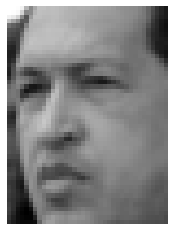
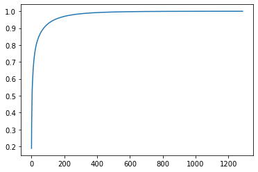
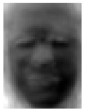
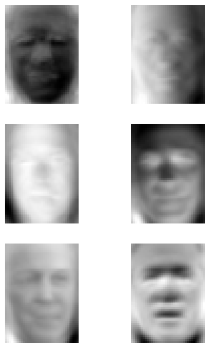
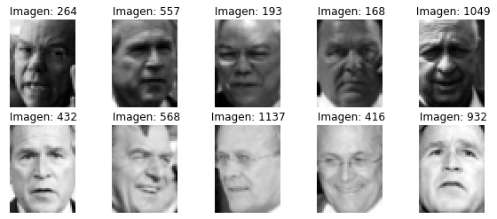
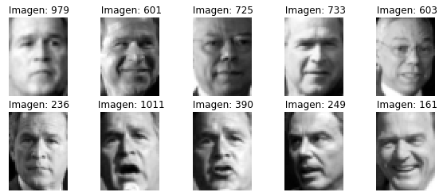
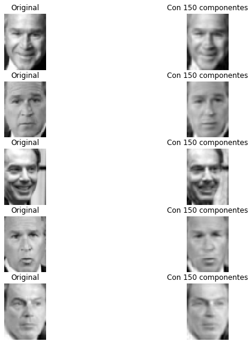
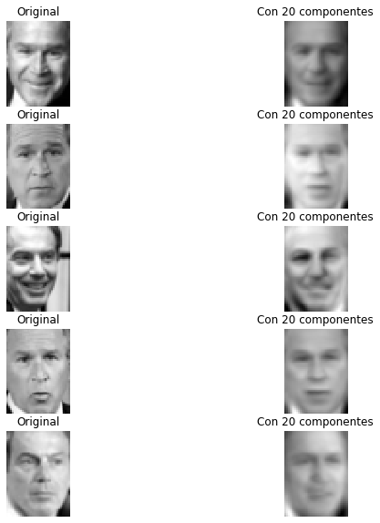

# Trabajo de reducción de dimensión con componentes principales
## Introducción
En este trabajo, calcularemos los componentes principales asociados a un conjunto de fotos de caras, (provienen del sitio web ["Labeled Faces in the Wild"](http://vis-www.cs.umass.edu/lfw/), un conjunto de datos diseñados para testear algoritmos de reconocimientos de caras. 

Empezamos por cargar los módulos que solemos necesitar


```python
# Completar aquí

# --------------------

```


## Cargamos los datos.
El fichero que contiene los datos es faces.csv que se puede descargar del Aula Virtual y guardar en la carpeta data.
Contiene 5000 filas y 1024 columnas. Cada fila corresponde a una imagen de 32 x 32 pixeles. Cada columna corresponde a la intensidad de gris de un pixel.

Los datos están disponibles en `scikit-learn` usando la función `fetch_lfw_people`. Siguiendo el ejemplo en https://scikit-learn.org/stable/auto_examples/applications/plot_face_recognition.html#sphx-glr-auto-examples-applications-plot-face-recognition-py, 


```python
from sklearn.datasets import fetch_lfw_people
lfw_people = fetch_lfw_people(min_faces_per_person=70, resize=0.4)

```

Hemos especificado que queremos sólo las imágenes de personas para las que hay como mínimo 70 datos (imágenes), y hemos realizado un cambio de tamaño de cada imagen. El objeto `lfw_people` tiene varios atributos interesantes: 
- `data` que es un `np.ndarray` que contiene una fila por imagen, 
- `images` que es un `np.ndarray` con tres dimensiones: la primera corresponde al número de la imagen, la segunda y tercera a la altura y anchura de cada imagen.
- `target` son las etiquetas (números enteros) de personas
- `target_names` son los nombres de las personas correspondiente a cada etiqueta.

Crear los arrays `X` que contenga las características, `y` que contenga las etiquetas, así como `imagenes` que contenga el array de imágenes.

Cuántos datos contiene el conjunto, de cuántos píxeles es cada imagen, cuántas personas están representadas, quienes son y con qué frecuencia aparecen en el conjunto cada uno de ellos?


```python
# Completar aquí

# --------------------

```

    El conjunto contiene 1288 datos, para cada imagen, la altura es 50 píxeles, el ancho es 37 píxeles.
    En total son 7 personas, y cada una aparece con las siguientes frecuencias: 
     3    530
    1    236
    6    144
    2    121
    4    109
    0     77
    5     71
    dtype: int64
    Ordenadas por etiquetas de 0 a 6, son las siguientes personas: ['Ariel Sharon' 'Colin Powell' 'Donald Rumsfeld' 'George W Bush'
     'Gerhard Schroeder' 'Hugo Chavez' 'Tony Blair']


Vamos a representar la primera imagen, por ejemplo, usando el mismo código que usamos para representar los dígitos en la práctica anterior, pero ahora usamos el colormap "gray".


```python
# Completar aquí

# --------------------

```


    

    


Y ahora, representamos 100 al azar, (he usado aquí la semilla 314)


```python
# Completar aquí


```


    

    


## Reducción de la dimensión con componentes principales.

En el conjunto inicial tenemos 1024 variables, vamos a explorar la reducción de dimensión usando componentes principales.

### Obtención de los componentes principales.
Podemos usar la clase `PCA` del submódulo `decomposition`. Admite el parámetro `n_components` que indica con cuántos componentes nos queremos quedar. Si no especificamos nada, calcula todos los componentes. Se trata de un transformador, después de instanciarlo en un objeto llamado `acp`, usando todos los componentes, y ajustarlo calculad las coordenadas de cada imagen en cada componente principal usando `transform`. 


```python
# Completar aquí

# --------------------

```

Cuál es la dimensión de `Z`? Podemos obtener las varianzas de cada componente con el atributo `explained_variance_` de `acp`. Cuáles son los tres primeros auto-valores de la matriz de covarianza de `X`?


```python
# Completar aquí

# --------------------

```

    Los tres primeros autovalores de la matriz de covarianzas de X son: [487947.6  390398.88 188346.34]


Usando el atributo `explained_variance_ratio_`, obtenemos la proporción de varianza explicada por cada componente. Realizad la gráfica de la proporción de varianza explicada acumulada.


```python
# Completar aquí

# --------------------

```


    

    


Qué proprición de varianza explicada se alcanza con 150 componentes?


```python
# Completar aquí

# --------------------

```

    Si nos quedamos con 150 componentes, la proporción de varianza explicada es 0.95


## Reducción a 150 componentes.
Visto la evolución de la proporción de varianza explicada, vamos a quedarnos con 150 componentes. Para ello, podemos especificar en el momento de instanciar `PCA` el parámetro `n_components`. Repetir el análisis específicando directamente 150 componentes, creando la matriz `Z` de puntuaciones de cada imagen en los 150 componentes.


```python
# Completar aquí

# --------------------

```

Podemos obtener los coeficientes que definen cada componente usando el atributo `components_`. Almacena los componentes de manera horizontal, el primer componente, por ejemplo, es la primera fila de `components_`.


```python
acp.components_
```


    array([[-0.00681708, -0.00736364, -0.0085503 , ..., -0.01404501,
            -0.01195594, -0.00964072],
           [ 0.02166518,  0.02048151,  0.02229038, ..., -0.04291791,
            -0.04126054, -0.03962976],
           [-0.02165628, -0.01930318, -0.01778274, ..., -0.05017732,
            -0.04404116, -0.03936808],
           ...,
           [-0.00949095, -0.01295486, -0.0086368 , ..., -0.04627866,
             0.00643124,  0.10026915],
           [-0.08086779, -0.01053547,  0.06775146, ..., -0.01508493,
            -0.05429213, -0.07747245],
           [ 0.03915421,  0.02792941,  0.00812925, ...,  0.0567507 ,
            -0.00053123, -0.04528632]], dtype=float32)


Cúal es el pixel que tiene mayor peso (en valor absoluto) en el primer componente? y en el segundo? 


```python
# Completar aquí


```

    El píxel que más peso tiene en el primer componente se sitúa en la fila 38 y la columna 27
    El píxel que más peso tiene en el segundo componente se sitúa en la fila 48 y la columna 33


Podemos representar los pesos de cada pixel en el primer componente en forma de una imagen, donde la intensidad de gris es proporcional al peso de este pixel en PC1.


```python
# Completar aquí

# --------------------

```


    

    


Representad estos pesos para las seis primeras componentes


```python
# Completar aquí


```


    

    


Representad las 5 imágenes del conjunto que más puntúan en el primer componente y las cinco que menos puntúan en este componente. Consejo: podéis usar `argsort` de `numpy`.


```python
# Completar aquí

# --------------------

```


    

    


Realizad la misma representación para el segundo componente:


```python
# Completar aquí

# --------------------

```


    

    


## Reconstrucción de las imágenes después de la reducción de dimensión

`Z` es la matriz de coordenadas de cada imagen en las 150 primeras componentes principales. Si aplicamos al transformador `acp` el método `inverse_transform` pasándole como argumento `Z`, lo que hacemos es completar 0 todos los componentes que faltan y deshacer el cambio de sistema de coordenadas, de manera que volvemos a situarnos en el sistema de intensidad de grises de los píxeles. 


```python
# Completar aquí

# --------------------

```


    

    


Repetid la representación si sólo nos quedamos con 20 componentes


```python
# Completar aquí

# --------------------

```


    

    

