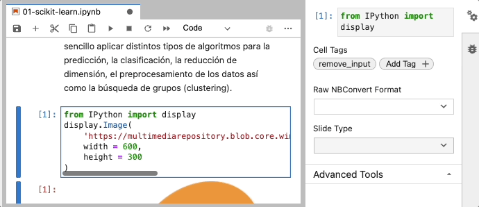

# Diferentes utilidades para generar entregables, transparencias etc..
Esta carpeta contiene distintos scripts de utilidades, que uso para generar entregables, o las transparencias HTML a partir de un bloc de notas Jupyter.

## Generar un entregable de trabajo a partir del bloc de notas Jupyter.

Los enunciados de trabajos entregables consisten siempre de dos elementos:
1. Un bloc de notas de nombre tipo `trabajo_handout.ipynb` donde los alumnos tienen celdas de código vacías o parcialmente vacías si hay alguna indicación. Tienen que entregar este bloc de notas completado.
2. Un fichero html con las salidas esperadas del trabajo, que se llama `trabajo_output.html`. Los alumnos pueden fijarse en estas salidas esperadas para comprobar que obtienen, con su código, lo que se espera.

Para generar estos dos elementos, tengo mi bloc de notas `trabajo.ipynb`, donde en las celdas pongo el código solución, pero precedido por una línea que empieza por `# Completar aquí` y seguido por una línea que empieza por `# Fin Completar aquí`. (Se deben respetar espacios, mayúsculas y tíldes) 
Por ejemplo:
En `trabajo.ipynb` tengo un bloque:
```
# Completar aquí
geyser = pd.read_csv("datos_geyser.csv")
# Fin Completar aquí
geyser
```

que se transformará en `trabajo_handout.ipynb` en
```
# Completar aquí

# ---------------------------
geyser
```

El script que se encarga de generar estos entregables es `generate_handout_ipynb.py` que admite como argumento la ruta hasta el fichero `ipynb` que hay que procesar y además el parámetro --target que puede tomar dos valores lab o slides. Para generar un entregable si usa el valor lab.
Se debe ejecutar en un entorno virtual que tenga jupyter instalado.

```
python3 generate_handout_ipynb.py ../trabajos/trabajo.ipynb --target labhandout
```

> Nota: se debe ejecutar este comando en un entorno donde esté instalado ipykernel, por ejemplo el base de conda, o el entorno `ids` del curso.

## Generar transparencias usando notebooks en Jupyter Lab.

En algunos temas he usado la exportación a Reveal.js de notebooks en Jupyter lab para producir las transparencias. Concretamente, uso el script `generate_handout_ipynb.py` ya mencionado en el párrafo anterior, pero con el argumento `--target labhandout`.

Tal como se explica en la [documentación de Jupyter lab](https://jupyterlab.readthedocs.io/en/stable/user/export.html#reveal-js-slides), se especifica el efecto deseado en la presentación en el menú "Slide Type" situado, para cada celda, en el "Property inspector" en la barra lateral de la derecha. Uso el tipo "Slide", "Sub-slide" y "Fragment".

Además, hay casos en los que no quiero que aparezca el input de la celda sino solamente el output. Ese es el caso cuando importo una imagen por ejemplo. También hay casos en los que no quiero que aparezca el output, por ser demasiado largo. Para estos casos, uso tags en las celdas correspondientes. Estos tags se pueden añadir también en el "Property inspector" de cada celda:

- He definido el tag "remove_input", para las celdas donde no debe aparecer el input en la exportación.
- He definido el tag "remove_output" para las celdas donde no debe aparecer el input en la importación.

Para activar un tag que ya está presente en el notebook, basta con seleccionarlo en el "Property inspector". Si no está todavía presente, debo añadirlo con "Add tag".



Una vez los efectos y las posibles etiquetas especificadas para las celdas relevantes, ejecuto

```
python3 generate_handout_ipynb.py ../transparencias/08-plotting/01-visualizacion_matplotlib.ipynb --target slides
```

Como resultado del script, hay varios ficheros:
- 01-visualizacion_matplotlib.slides.html
Es el fichero de la presentación, donde se han aplicado los efectos y se han quitado los inputs o outputs de las celdas con los tags correspondientes.
- 01-visualizacion_matplotlib_handout.html
Es el fichero de la presentación, pero donde se han eliminado los efectos de tipo fragment (aparición de bloques de contenido en la transparencias).
Este fichero se abre directamente en el navegador al ejecutar el script. Se puede entonces exportar a pdf, siguiendo las instrucciones de [documentación de Reveal.js](https://revealjs.com/pdf-export/). Por ejemplo, en el caso de las transparencias para matplotlib, en mi ordenador, la url para la impresión es http://127.0.0.1:8000/01-visualizacion_matplotlib_handout.slides.html?print-pdf 

## Compilar transparencias Latex que usen código Python:

Uso [pythontex](https://www.ctan.org/pkg/pythontex) que, por ejemplo, está incluido en TexLive 2020. Para compilar el documento Latex que contiene código Python según el formato pythontex
1. ejecuto pdflatex sobre el documento `fichero_transparencias.tex`
2. abro una terminal y, en el entorno virtual en el que se debe ejecutar el código del fichero, ejecuto
``` 
pythontex fichero_transparencias.tex
```
3. Vuelvo a ejecutar pdflatex sobre el documento.
